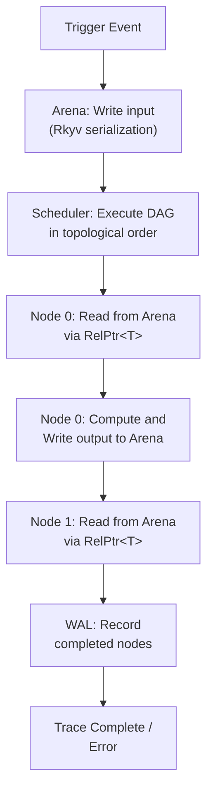
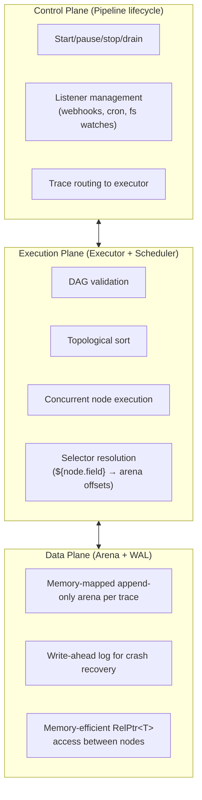
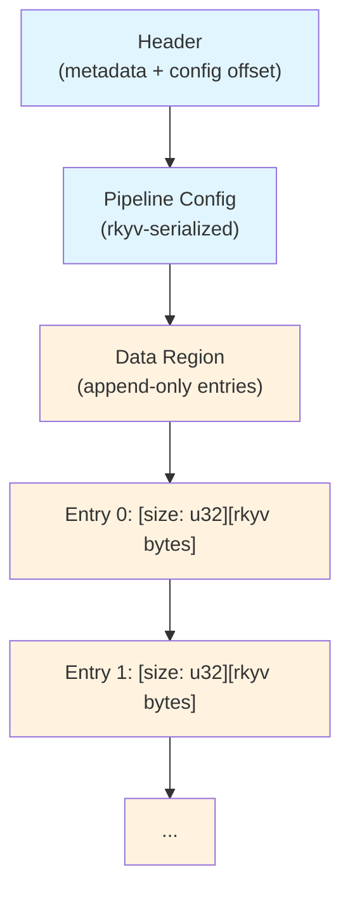

# XERV: Workflow Orchestration Engine

XERV is a workflow orchestration platform for building data pipelines and automations. It combines the accessibility of low-code tools (n8n, Zapier) with the reliability of systems engineering (Temporal, Rust).

**Key characteristics:**

- **Memory-mapped arena** for efficient data passing between pipeline stages
- **Async pipeline execution** with topological DAG scheduling
- **YAML-based flow definitions** with no visual editor needed
- **Standard library nodes** for merge, split, switch, loop operations
- **Testable workflows** with mock providers for time, HTTP, filesystems
- **Fault-tolerant execution** via write-ahead logs (WAL) and crash recovery

## Deployment Modes

XERV is **library-first**: the core engine lives in `xerv-core` and `xerv-executor`, deployed in two complementary ways.

| Aspect            | Library Mode                             | Server Mode                         |
| ----------------- | ---------------------------------------- | ----------------------------------- |
| **Use Case**      | Embed in Rust app                        | Standalone service/cluster          |
| **Example**       | HFT bot, IoT/edge device, async refactor | Microservices, enterprise pipelines |
| **Communication** | Direct function calls                    | REST/gRPC API                       |
| **Latency**       | Microseconds                             | Milliseconds                        |
| **Backend**       | In-process                               | Memory, Raft, Redis, or NATS        |
| **Scaling**       | Vertical                                 | Horizontal (multi-node cluster)     |
| **Deployment**    | `your-app` binary                        | `xerv serve` + Kubernetes/Docker    |

**Migration Path:** Start with library mode. Scale to server mode when you need external orchestration—the flow definitions and node logic remain unchanged.

## Quick Start

See the [Getting Started Guide](docs/getting-started.md) for detailed setup instructions.

### Installation

Add to your `Cargo.toml`:

```toml
[dependencies]
xerv-core = "0.1"
xerv-executor = "0.1"
xerv-nodes = "0.1"
tokio = { version = "1.49", features = ["full"] }
```

### Write a Flow (YAML)

Create `flows/order_processing.yaml`:

```yaml
name: order_processing
version: "1.0"

triggers:
  - id: api_webhook
    type: webhook
    params:
      port: 8080
      path: /orders

nodes:
  fraud_check:
    type: std::switch
    config:
      condition:
        type: greater_than
        field: risk_score
        value: 0.8

  process_safe:
    type: std::log
    config:
      message: "Processing safe order"

  process_risky:
    type: std::log
    config:
      message: "Flagging risky order"

  merge_results:
    type: std::merge
    config:
      strategy: wait_all

edges:
  - from: api_webhook
    to: fraud_check

  - from: fraud_check.false
    to: process_safe

  - from: fraud_check.true
    to: process_risky

  - from: process_safe
    to: merge_results

  - from: process_risky
    to: merge_results
```

### Load and Execute

```rust
use xerv_executor::prelude::*;
use xerv_nodes::prelude::*;

#[tokio::main]
async fn main() -> Result<()> {
    // Load the flow from YAML
    let config = LoaderConfig::default();
    let flow = FlowLoader::load_file("flows/order_processing.yaml", &config)?;

    // Create a pipeline controller
    let pipeline = Pipeline::new(flow.loaded)?;

    // Start listeners (webhooks, cron, etc.)
    let listeners = pipeline.start_listeners().await?;

    // Run traces as they come in
    let executor = pipeline.executor();
    while let Some(trace) = executor.next_trace().await {
        let result = executor.run(trace).await?;
        println!("Trace completed: {:?}", result);
    }

    Ok(())
}
```

### Test Your Flow

```rust
#[tokio::test]
async fn test_fraud_detection() {
    let input = serde_json::json!({
        "order_id": "ORD-123",
        "risk_score": 0.95,
        "amount": 5000
    });

    let result = FlowRunner::new()
        .with_fixed_time("2024-01-15T10:00:00Z")
        .set_entry_point(NodeId::new(0))
        .run(serde_json::to_vec(&input).unwrap())
        .await
        .unwrap();

    assert!(result.is_success());
    assert_eq!(result.completed_nodes.len(), 4);
}
```

## How XERV Works

### Data Flow



### Architecture



## Core Concepts

### Nodes

A **node** is a discrete unit of work. Nodes:

- Have typed input/output ports
- Execute async functions
- Write results to the arena
- Can be written in Rust or WebAssembly

**Flow Control Nodes:**

- **`std::merge`** - N→1 barrier (waits for all inputs before continuing)
- **`std::split`** - 1→N fan-out (iterates over collection, spawning parallel executions)
- **`std::switch`** - Conditional routing (branches execution based on expression evaluation)
- **`std::loop`** - Controlled iteration (loops with configurable exit condition)
- **`std::wait`** - Human-in-the-loop approval (suspends trace pending external decision)

**Data Manipulation Nodes:**

- **`std::map`** - Field renaming and transformation (maps input fields to output schema)
- **`std::concat`** - String concatenation (joins multiple strings with separator)
- **`std::aggregate`** - Numeric aggregation (sum, avg, min, max over collections)
- **`std::json_dynamic`** - Schemaless JSON handling (dynamic field extraction)

### Triggers

A **trigger** initiates pipeline execution in response to events. Available triggers:

**HTTP Triggers:**

- **`webhook`** - HTTP POST endpoint that accepts incoming events

**Time-Based Triggers:**

- **`cron`** - Scheduled execution using cron expressions (e.g., `"0 12 * * *"`)

**File System Triggers:**

- **`filesystem`** - Watches directories for file creation/modification/deletion events

**Message Queue Triggers:**

- **`queue`** - In-memory message queue for inter-process communication
- **`kafka`** - Kafka topic consumer for distributed event streaming

**Testing Triggers:**

- **`manual`** - Manual invocation for testing and development
- **`memory`** - Direct memory injection for benchmarking

### Edges

An **edge** connects output port of one node to input port of another. Format:

```
from: node_name.port_name
to: other_node.input_port_name
```

For conditional nodes like `std::switch`, use special ports:

```
from: fraud_check.true    # When condition is true
to: process_risky

from: fraud_check.false   # When condition is false
to: process_safe
```

### Selectors

A **selector** is a template string for referencing data:

```
${node_name.field.path}
${pipeline.config.max_value}
```

Selectors are resolved at runtime by the **linker**, which:

1. Parses selector expressions from config
2. Maps node fields to arena offsets (RelPtr<T>)
3. Provides type-safe access during execution

Example in a node config:

```yaml
nodes:
  check_limit:
    type: std::switch
    config:
      condition:
        type: greater_than
        field: amount
        value: ${pipeline.config.limit} # Resolved at link time
```

### Arena

The **arena** is a memory-mapped file where all trace data lives. Each trace gets its own arena at `/tmp/xerv/trace_{uuid}.bin`.

Layout:



Nodes access data via **relative pointers** (`RelPtr<T>`), which are stable across process restarts since they're offsets from the arena base.

### Write-Ahead Log (WAL)

The **WAL** records node completions before execution continues. On crash:

1. Incomplete nodes replay from their input
2. Complete nodes skip execution
3. Results are read from the arena

This enables **fault-tolerant** trace execution.

## Key Features

### Fault Tolerance

- **Write-Ahead Log (WAL)** - Node completions recorded before execution continues
- **Crash Recovery** - Automatic replay of incomplete nodes after failure
- **Idempotent Execution** - Safe to retry traces without duplicating side effects
- **Circuit Breaker** - Automatic pipeline pausing on high error rates

### Scalability & Deployment

- **Pluggable Dispatch Backends** - Choose from Memory (local), Raft (consensus), Redis (cloud), or NATS (streaming)
- **Horizontal Scaling** - Auto-scale workers based on queue depth or custom metrics
- **Kubernetes-Ready** - Full Helm chart with HPA, KEDA, VPA support
- **Docker Compose** - Quick local dev with zero configuration
- **Multi-Cluster Federation** - Deploy across regions with automatic failover

### High Availability

- **Distributed Clustering** - Multi-node coordination via OpenRaft Raft consensus
- **Leader Election** - Automatic failover when leader node fails
- **State Replication** - Consistent trace state across cluster nodes
- **gRPC Network Transport** - Efficient inter-node communication
- **Service Mesh Compatible** - Istio and Linkerd integration for enterprise security

### Human-in-the-Loop

- **Suspension System** - Pause traces pending external approval or decision
- **Manual Resume** - Resume suspended traces with updated context
- **Timeout Handling** - Automatic failure or skip after configurable duration

### Testing & Debugging

- **Mock Providers** - Clock, HTTP, filesystem, RNG, secrets, environment
- **Deterministic Execution** - Fixed time and seeds produce consistent results
- **Trace Introspection** - Inspect completed nodes, outputs, and execution state
- **Chaos Testing** - Inject failures to test error handling

### Production Operations

- **REST API** - Full pipeline lifecycle and trace management
- **Prometheus Metrics** - Built-in metrics endpoint with Grafana dashboards
- **Structured Logging** - JSON logs with trace ID correlation for ELK/Loki integration
- **Distributed Tracing** - OpenTelemetry integration with Jaeger/Tempo support
- **Alert Rules** - PrometheusRule templates for key metrics (error rate, queue depth, leader health)
- **Resource Cleanup** - Automatic cleanup of timed-out traces, WAL segments, and arena files
- **Graceful Shutdown** - Clean termination of in-flight traces and listeners

## Documentation

### Getting Started (5-15 minutes)

- **[Getting Started](docs/getting-started.md)** - Setup guide with working example (5 minutes)
- **[Quick Reference](docs/quick-reference.md)** - Node types, triggers, API endpoints at a glance
- **[Docker Setup](docker/README.md)** - Quick local dev with Docker Compose

### Architecture & Design (30-40 minutes)

- **[Architecture Deep Dive](docs/architecture.md)** - Arena, scheduler, execution model, dispatch backends
- **[Deployment Guide](docs/deployment.md)** - Choose your backend (Memory/Raft/Redis/NATS), deploy anywhere

### Operations & Deployment (20-40 minutes)

- **[Helm Chart (Kubernetes)](charts/xerv/README.md)** - Production deployments with auto-scaling
- **[Docker Compose](docker/README.md)** - Single-node or local development
- **[Deployment Scenarios](docs/deployment.md)** - Dev, on-prem, cloud, multi-region

### Features & Advanced Usage (20-40 minutes)

- **[Triggers](docs/triggers.md)** - Webhook, Cron, Kafka, Filesystem event sources
- **[Suspension System](docs/suspension-system.md)** - Human-in-the-loop approval workflows
- **[Writing Custom Nodes](docs/nodes.md)** - Build your own node types
- **[Testing Guide](docs/testing.md)** - Deterministic testing with mocks

### Reference

- **[REST API Reference](docs/api.md)** - Complete API documentation with examples
- **[Documentation Index](docs/INDEX.md)** - Complete guide to all resources

## Project Structure

```
xerv/
├── xerv-core/       # Arena, WAL, core traits, dispatch backends (Memory/Raft/Redis/NATS)
├── xerv-nodes/      # Standard library (merge, split, switch, loop, wait, etc.)
├── xerv-executor/   # Scheduler, linker, pipeline controller, REST API, observability
├── xerv-cluster/    # Distributed clustering with OpenRaft consensus
├── xerv-operator/   # Kubernetes operator for advanced deployments
├── xerv-cli/        # CLI binary (serve, inspect, validate)
├── xerv-macros/     # Procedural macros (#[xerv::node], #[xerv::schema])
├── charts/xerv      # Helm chart for Kubernetes deployments
└── docker/          # Docker Compose configs (Memory/Raft/Redis/NATS)
```

## Development

```bash
# Build all crates
cargo build --release

# Run tests
cargo test --all

# Check code quality
cargo clippy --all-targets -- -D warnings
cargo fmt --all --check
```

## License

Apache License 2.0 - See [LICENSE](LICENSE) for details.
