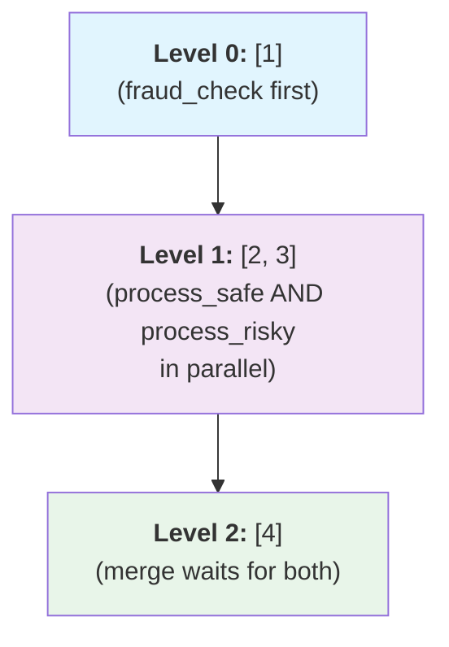
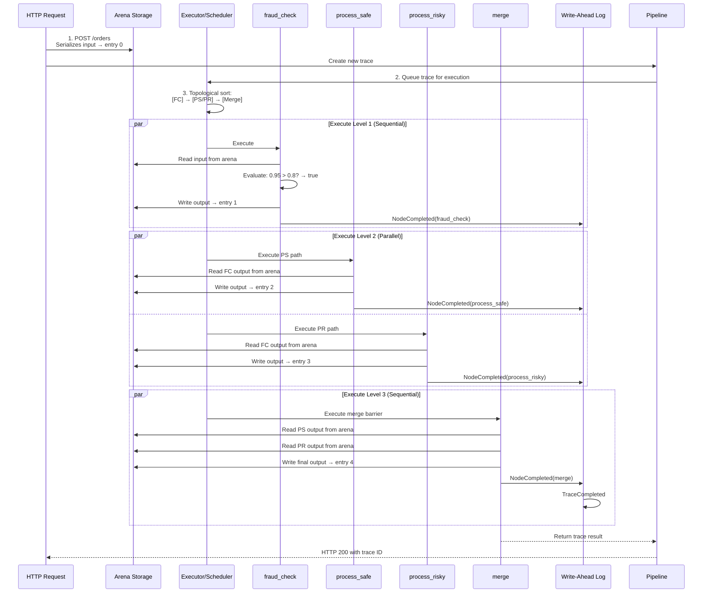

# XERV Architecture

This document explains how XERV executes traces with efficient memory usage, crash recovery, and deterministic scheduling.

## System Overview

XERV has three layers, with optional distributed clustering:


## Data Plane: Memory-Efficient Storage

### Arena File Format

Each trace has its own arena file at `/tmp/xerv/trace_{trace_id}.bin`:


The **Header** contains:

- Trace ID (UUID)
- Current data offset (points to end of written data)
- Pipeline config offset and size
- WAL file path
- Timestamps (created, modified)

### Memory Mapping

The arena uses memory mapping via `memmap2`:

```rust
// Writer creates the file and mmaps it
let file = File::create("/tmp/xerv/trace_abc123.bin")?;
let mut arena = Arena::create(trace_id, config)?;

// Nodes write data to the mmap'd region
let ptr = arena.write(&my_data)?;  // Returns RelPtr<T>

// Other nodes access via offset (no allocation)
let read_guard = arena.read(ptr)?;  // Returns archived reference
```

Benefits:

- **Efficient data passing** between writes and reads
- **Persistent** across process restarts (pointer is just an offset)
- **Multi-reader safe** (OS handles concurrent access)
- **Optimized paging** - kernel page cache handles memory efficiently

### Rkyv Serialization

All data is serialized with **rkyv** (Relative Knowledge Virtual Machine), which enables efficient deserialization without allocations:

```rust
use rkyv::{Serialize, Archive, Deserialize};

#[derive(Serialize, Archive, Deserialize)]
pub struct Order {
    pub id: String,
    pub amount: f64,
    pub risk_score: f64,
}

// Writer: Serialize and write to arena
let order = Order { id: "123".into(), amount: 100.0, risk_score: 0.5 };
let bytes = rkyv::to_bytes::<_, 256>(&order)?;
let ptr = arena.write_bytes(&bytes)?;

// Reader: Access via archived reference
let archived: &ArchivedOrder = unsafe { arena.archived_ref::<Order>(ptr)? };
println!("Amount: {}", archived.amount);  // Efficient field access
```

### Relative Pointers (RelPtr<T>)

A `RelPtr<T>` stores the offset from the arena base, not an absolute address:

```rust
pub struct RelPtr<T> {
    offset: u32,    // Relative to arena base (not memory address!)
    _phantom: PhantomData<T>,
}

impl<T> RelPtr<T> {
    pub fn offset(&self) -> u32 {
        self.offset
    }

    pub fn from_offset(offset: u32) -> Self {
        Self {
            offset,
            _phantom: PhantomData,
        }
    }

    // Access the data (requires arena context)
    pub fn deref(&self, arena: &Arena) -> Result<&ArchivedT> {
        let base = arena.data_region_ptr();
        unsafe {
            let addr = (base as usize + self.offset as usize) as *const ArchivedT;
            Ok(&*addr)
        }
    }
}
```

Why relative offsets?

- Survive process restarts (mmap may remap at different virtual address)
- Safe for serialization (not absolute memory addresses)
- Compact storage (u32 offset vs u64 pointer)

## Execution Plane: Scheduling

### DAG Construction

The **FlowBuilder** converts YAML to a **FlowGraph**:

```rust
pub struct FlowGraph {
    nodes: HashMap<NodeId, GraphNode>,
    edges: Vec<Edge>,
    entry_points: Vec<NodeId>,
}

pub struct GraphNode {
    id: NodeId,
    node_type: String,  // e.g., "std::switch", "std::merge"
}

pub struct Edge {
    from_node: NodeId,
    from_port: String,
    to_node: NodeId,
    to_port: String,
}
```

Example: Order processing flow

```yaml
nodes:
  fraud_check: # NodeId 1
    type: std::switch

  process_safe: # NodeId 2
    type: std::log

  process_risky: # NodeId 3
    type: std::log

  merge: # NodeId 4
    type: std::merge

edges:
  - from: fraud_check.false → process_safe
  - from: fraud_check.true → process_risky
  - from: process_safe → merge
  - from: process_risky → merge
```

Results in DAG:


### Topological Sorting

The Executor validates the DAG and produces an execution order:

```rust
pub struct Executor {
    graph: FlowGraph,
    execution_order: Vec<Vec<NodeId>>,  // Levels of parallel execution
    state: TraceState,
}

impl Executor {
    pub fn new(graph: FlowGraph) -> Result<Self> {
        // 1. Detect cycles
        let cycles = graph.find_cycles()?;
        if !cycles.is_empty() {
            return Err(XervError::CyclicGraph { cycles });
        }

        // 2. Topological sort (Kahn's algorithm)
        let execution_order = graph.topological_sort()?;

        Ok(Self {
            graph,
            execution_order,
            state: TraceState::new(),
        })
    }
}
```

For the order flow, execution_order becomes:



### Concurrent Execution

The Executor uses **signals** to coordinate async execution:

```rust
pub struct ExecutionSignal {
    node_id: NodeId,
    state: ExecutionState,  // Running, Completed, Failed
}

pub struct Executor {
    signals: DashMap<NodeId, ExecutionSignal>,
    trace_state: TraceState,
}

impl Executor {
    pub async fn run(&self, trace: Trace) -> Result<TraceResult> {
        // Execute each level sequentially, but nodes within level concurrently
        for level in &self.execution_order {
            // Wait for all nodes in previous level
            self.wait_level_complete(level - 1).await?;

            // Launch all nodes in this level as concurrent tasks
            let mut handles = vec![];
            for node_id in level {
                let handle = tokio::spawn(self.execute_node(*node_id, trace));
                handles.push(handle);
            }

            // Wait for all tasks to complete
            for handle in handles {
                handle.await???;
            }
        }

        Ok(trace.finalize()?)
    }

    async fn execute_node(&self, node_id: NodeId, trace: &Trace) -> Result<()> {
        // 1. Read input data from arena via RelPtr
        let input = trace.arena.read(trace.input_ptr)?;

        // 2. Execute node logic
        let output = node.execute(input, trace.context).await?;

        // 3. Write output to arena
        let output_ptr = trace.arena.write(&output)?;

        // 4. Signal completion
        self.signals.insert(node_id, ExecutionSignal {
            state: ExecutionState::Completed,
            output_ptr,
        });

        Ok(())
    }
}
```

## Linker: Selector Resolution

The **Linker** resolves selector expressions to arena offsets at link time:

### Parsing

```rust
pub struct Selector {
    raw: String,           // "${fraud_check.score}"
    root: String,          // "fraud_check"
    path: Vec<String>,     // ["score"]
}

pub fn parse(input: &str) -> Result<Vec<Selector>> {
    // Regex: \$\{([a-z_]+)(?:\.([a-z_.]+))?\}
    // Returns all selectors in the string
}
```

### Resolution

```rust
pub struct CompiledSelector {
    node_id: NodeId,
    field_offset: u32,     // Offset within the rkyv struct
    schema_name: String,   // For type checking
}

pub struct Linker {
    compiled: HashMap<String, CompiledSelector>,
}

impl Linker {
    pub fn compile(flow: &FlowDefinition) -> Result<Self> {
        let mut compiled = HashMap::new();

        // For each node with selectors in config
        for (node_id, node) in &flow.nodes {
            let selectors = SelectorParser::parse_all(&node.config)?;

            for selector in selectors {
                // Look up the source node's schema
                let source_node = flow.nodes.get(&selector.root)?;
                let schema = Schema::for_type(&source_node.output_type)?;

                // Find field offset in rkyv struct
                let field_offset = schema.field_offset(&selector.path)?;

                compiled.insert(selector.raw, CompiledSelector {
                    node_id: get_node_id(&selector.root),
                    field_offset,
                    schema_name: source_node.output_type.clone(),
                });
            }
        }

        Ok(Self { compiled })
    }

    pub fn resolve(&self, selector: &str, arena: &Arena) -> Result<RelPtr<Value>> {
        let compiled = self.compiled.get(selector)?;

        // Get the base pointer for this node's output
        let base_ptr = arena.node_output(compiled.node_id)?;

        // Calculate the field offset
        let field_ptr = RelPtr::<Value>::new(
            base_ptr.offset() + compiled.field_offset
        );

        Ok(field_ptr)
    }
}
```

### Example

Node config:

```yaml
check_limit:
  type: std::switch
  config:
    condition:
      type: greater_than
      field: amount
      value: ${pipeline.config.limit}
```

At link time:

```
Selector: "${pipeline.config.limit}"
├─ Root: "pipeline"
├─ Path: ["config", "limit"]
├─ Source schema: PipelineConfig
├─ Field offset in rkyv struct: 24
└─ Compiled selector: {
     node_id: 0,
     field_offset: 24,
     schema: "PipelineConfig"
   }
```

At runtime:

```
arena.read(compiled_selector.resolve(arena))
├─ base_ptr = arena.node_output(pipeline_node)
├─ field_ptr = base_ptr + 24
└─ value = 1000.0  (from archived struct)
```

## Control Plane: Pipeline Lifecycle

The **Pipeline** manages the overall lifecycle:

```rust
pub enum PipelineState {
    Stopped,
    Running,
    Paused,
    Draining,
}

pub struct Pipeline {
    state: Arc<Mutex<PipelineState>>,
    listeners: ListenerPool,
    executor: Arc<Executor>,
    metrics: Arc<PipelineMetrics>,
}

impl Pipeline {
    pub async fn start(&self) -> Result<()> {
        // 1. Start all enabled listeners (webhooks, cron, fs)
        self.listeners.start_all().await?;

        // 2. Begin accepting traces
        self.state.lock().await.transition(PipelineState::Running)?;

        Ok(())
    }

    pub async fn pause(&self) -> Result<()> {
        // Stop accepting new traces
        // In-flight traces continue
        self.state.lock().await.transition(PipelineState::Paused)?;
        Ok(())
    }

    pub async fn drain(&self) -> Result<()> {
        // Stop accepting new traces
        // Wait for all in-flight traces to complete
        self.state.lock().await.transition(PipelineState::Draining)?;
        self.listeners.stop_all().await?;

        loop {
            if self.executor.active_traces() == 0 {
                break;
            }
            tokio::time::sleep(Duration::from_millis(100)).await;
        }

        Ok(())
    }
}
```

## Crash Recovery: Write-Ahead Log

The **WAL** ensures durability:

### Writing

```rust
pub struct Wal {
    file: File,
    checkpoint_interval: usize,
}

impl Wal {
    pub fn record_node_completion(
        &mut self,
        trace_id: TraceId,
        node_id: NodeId,
        output_ptr: RelPtr<Value>,
    ) -> Result<()> {
        let record = WalRecord {
            timestamp: now(),
            trace_id,
            event: WalEvent::NodeCompleted {
                node_id,
                output_ptr,
            },
        };

        // Write to file synchronously
        let bytes = rkyv::to_bytes::<_, 256>(&record)?;
        self.file.write_all(&bytes)?;
        self.file.flush()?;

        Ok(())
    }
}
```

### Recovery

```rust
pub struct CrashReplayer {
    wal: Wal,
}

impl CrashReplayer {
    pub async fn replay(&self, trace_id: TraceId) -> Result<TraceState> {
        let records = self.wal.read_records(trace_id)?;

        let mut state = TraceState::new();

        for record in records {
            match record.event {
                WalEvent::NodeCompleted { node_id, output_ptr } => {
                    // Mark node as complete, skip re-execution
                    state.mark_complete(node_id, output_ptr);
                }
                WalEvent::TraceFailed { error } => {
                    // Trace previously failed
                    state.mark_failed(error);
                    break;
                }
            }
        }

        Ok(state)
    }

    pub async fn execute_with_recovery(
        &self,
        trace: Trace,
    ) -> Result<TraceResult> {
        // Replay completed nodes from WAL
        let previous_state = self.replay(trace.id)?;

        // Execute only incomplete nodes
        for node in self.executor.execution_order {
            if previous_state.is_complete(node.id) {
                // Reuse output from arena
                continue;
            }

            // Execute and WAL record
            let output = node.execute(trace.context).await?;
            self.wal.record_node_completion(trace.id, node.id, output_ptr)?;
        }

        Ok(trace.finalize()?)
    }
}
```

## Putting It Together: A Trace Execution

Request arrives at webhook:



## Execution Modes

XERV supports two execution modes with different trade-offs. Choose based on your requirements:

### Local Mode (Single-Node)

**Best for:** High-throughput, low-latency workloads on a single machine.

```
┌─────────────────────────────────────────────┐
│              XERV Local Mode                │
│                                             │
│  ┌─────────┐   ┌─────────┐   ┌─────────┐   │
│  │ Trigger │──▶│Executor │──▶│  Arena  │   │
│  └─────────┘   └─────────┘   └─────────┘   │
│                     │                       │
│                     ▼                       │
│                ┌─────────┐                  │
│                │   WAL   │                  │
│                └─────────┘                  │
└─────────────────────────────────────────────┘
```

**Characteristics:**

- **Zero-copy data passing** - Nodes share data via RelPtr offsets in memory-mapped arena
- **Maximum throughput** - No network serialization overhead
- **Lowest latency** - Direct memory access, no consensus delays
- **Single point of failure** - No automatic failover

**When to use:**

- Edge deployments with local data processing
- High-frequency pipelines (1000+ traces/second)
- Latency-sensitive workloads (sub-millisecond node execution)
- Development and testing

**Configuration:**

```rust
// Local mode is the default - no cluster config needed
let executor = Executor::new(flow_graph)?;
executor.run(trace).await?;
```

### Distributed Mode (Cluster)

**Best for:** High availability and horizontal scaling across multiple machines.

```
┌─────────────────────────────────────────────────────────┐
│                  XERV Cluster Mode                       │
│                                                          │
│  ┌──────────┐    ┌──────────┐    ┌──────────┐          │
│  │  Node 1  │◄──▶│  Node 2  │◄──▶│  Node 3  │          │
│  │ (Leader) │    │(Follower)│    │(Follower)│          │
│  └────┬─────┘    └────┬─────┘    └────┬─────┘          │
│       │               │               │                 │
│       └───────────────┼───────────────┘                 │
│                       │                                 │
│               ┌───────▼───────┐                         │
│               │ Raft Consensus│                         │
│               │ (OpenRaft)    │                         │
│               └───────────────┘                         │
└─────────────────────────────────────────────────────────┘
```

**Characteristics:**

- **Automatic failover** - Leader election if current leader fails
- **State replication** - Pipeline definitions synced across nodes
- **Network overhead** - Consensus requires gRPC communication
- **Horizontal scaling** - Distribute load across nodes

**When to use:**

- Production deployments requiring high availability
- Geographic distribution (nodes closer to data sources)
- Workloads that can tolerate slightly higher latency for reliability
- Teams needing zero-downtime deployments

**Configuration:**

```rust
use xerv_cluster::{ClusterConfig, ClusterNode};

let config = ClusterConfig::builder()
    .node_id(1)
    .listen_addr("127.0.0.1:5000")
    .peers(vec![
        (2, "127.0.0.1:5001".to_string()),
        (3, "127.0.0.1:5002".to_string()),
    ])
    .build();

let node = ClusterNode::start(config).await?;
```

### Mode Comparison

| Aspect            | Local Mode                | Cluster Mode                    |
| ----------------- | ------------------------- | ------------------------------- |
| **Throughput**    | Highest (10k+ traces/sec) | Moderate (limited by consensus) |
| **Latency**       | Lowest (sub-ms possible)  | Higher (consensus round-trips)  |
| **Availability**  | Single point of failure   | Automatic failover              |
| **Data locality** | Zero-copy via RelPtr      | Network serialization required  |
| **Complexity**    | Simple deployment         | Requires cluster coordination   |
| **Use case**      | Edge, dev, high-frequency | Production HA, multi-region     |

### Architectural Trade-offs

**Zero-copy vs. Distribution:**
The RelPtr mechanism that enables zero-copy data passing is inherently local - offsets reference positions in a memory-mapped file on a single machine. When running in cluster mode:

1. **Trace affinity** - A trace executes entirely on one node (the arena is local)
2. **Work distribution** - The leader assigns new traces to nodes, but doesn't migrate mid-execution
3. **Metadata replication** - Pipeline definitions and completion status are replicated via Raft
4. **Data remains local** - Arena files are not replicated (would negate zero-copy benefits)

This design preserves the zero-copy performance advantage while enabling cluster-level coordination and failover.

## Performance Characteristics

### Memory

- **Efficient node communication** - RelPtr-based offset arithmetic
- **Append-only arena** - predictable allocation without garbage collection
- **Memory-mapped I/O** - kernel page cache optimization

### Latency

- **Async execution** - non-blocking node execution with tokio
- **Efficient data access** - rkyv archived reference without reallocation
- **Parallel scheduling** - concurrent node execution at each topological level

### Durability

- **Write-ahead log** - node completions recorded before continuing execution
- **Crash recovery** - replay incomplete nodes from previous execution state
- **Persistent offsets** - RelPtr survives process restarts

### Resource Management

- **Automatic cleanup** - timed-out traces, completed arena files, WAL segments
- **Graceful shutdown** - in-flight traces complete before termination
- **Circuit breaker** - prevents cascading failures during high error rates
- **Bounded memory** - log subscribers and suspension state are properly cleaned

## Reliability Features

### Circuit Breaker

The circuit breaker protects pipelines from cascading failures:

```rust
pub struct CircuitBreakerConfig {
    pub failure_threshold: u32,        // Failures before opening (default: 5)
    pub failure_window_secs: u64,      // Time window for counting (default: 60)
    pub recovery_timeout_secs: u64,    // Wait before retry (default: 30)
    pub success_threshold: u32,        // Successes to close circuit (default: 3)
}
```

**States:**

- **Closed** - Normal operation, all requests allowed
- **Open** - Circuit tripped, requests rejected immediately
- **HalfOpen** - Testing recovery, limited requests allowed

**Operation:**

1. Pipeline tracks failures within sliding window
2. When threshold exceeded, circuit opens (rejects all traces)
3. After recovery timeout, enters half-open state
4. If next N requests succeed, circuit closes
5. If any fail in half-open, returns to open state

### Distributed Clustering (xerv-cluster)

For high availability and horizontal scaling, XERV supports multi-node deployment:

**Architecture:**

```
┌─────────────────────────────────────────────────────────────┐
│                    XERV Cluster                             │
│                                                             │
│  ┌─────────────┐   ┌─────────────┐   ┌─────────────┐       │
│  │   Node 1    │   │   Node 2    │   │   Node 3    │       │
│  │  (Leader)   │   │ (Follower)  │   │ (Follower)  │       │
│  │             │   │             │   │             │       │
│  │ ┌─────────┐ │   │ ┌─────────┐ │   │ ┌─────────┐ │       │
│  │ │  Raft   │◄┼───┼─┤  Raft   │◄┼───┼─┤  Raft   │ │       │
│  │ │ Engine  │ │   │ │ Engine  │ │   │ │ Engine  │ │       │
│  │ └────┬────┘ │   │ └────┬────┘ │   │ └────┬────┘ │       │
│  │      │      │   │      │      │   │      │      │       │
│  │ ┌────▼────┐ │   │ ┌────▼────┐ │   │ ┌────▼────┐ │       │
│  │ │  State  │ │   │ │  State  │ │   │ │  State  │ │       │
│  │ │ Machine │ │   │ │ Machine │ │   │ │ Machine │ │       │
│  │ └─────────┘ │   │ └─────────┘ │   │ └─────────┘ │       │
│  └─────────────┘   └─────────────┘   └─────────────┘       │
│                                                             │
└─────────────────────────────────────────────────────────────┘
```

**Features:**

- **Raft Consensus** - Leader election and log replication via OpenRaft
- **Automatic Failover** - New leader elected if current leader fails
- **State Replication** - Trace execution state replicated across nodes
- **gRPC Transport** - Efficient inter-node communication
- **Membership Management** - Dynamic adding/removing of cluster nodes

**Usage:**

```rust
use xerv_cluster::{ClusterConfig, ClusterNode};

// Configure the cluster
let config = ClusterConfig::builder()
    .node_id(1)
    .listen_addr("127.0.0.1:5000")
    .peers(vec![
        (2, "127.0.0.1:5001".to_string()),
        (3, "127.0.0.1:5002".to_string()),
    ])
    .build();

// Start the node
let node = ClusterNode::start(config).await?;

// Commands are automatically routed to the leader
node.execute(ClusterCommand::StartTrace { ... }).await?;
```

**When to Use Clustering:**

- **High availability** - Survive node failures without downtime
- **Horizontal scaling** - Distribute trace execution across multiple nodes
- **Geographic distribution** - Place nodes closer to data sources
- **Load balancing** - Leader distributes work to followers

## Advanced Topics

### Custom Schemas

Define strongly-typed schemas for your data:

```rust
#[derive(Serialize, Archive, Deserialize, Schema)]
#[repr(C)]
pub struct Order {
    pub id: String,
    pub amount: f64,
    pub items: Vec<OrderItem>,
}

// Linker can now resolve selectors like ${order.items[0].sku}
```

### Declared Loops

Use `std::loop` to handle repeated execution:

```yaml
nodes:
  process_items:
    type: std::loop
    config:
      collection: ${order.items}
      exit_condition:
        field: count
        value: 100

edges:
  - from: process_items.loop_body
    to: validate_item
  - from: validate_item
    to: process_items.next_iteration
```

### WASM Nodes

Custom logic in WebAssembly:

```rust
let wasm_node = WasmNode::new(
    WasmNodeConfig {
        module_path: "nodes/my_logic.wasm",
        function: "process",
    }
)?;
```

See [nodes.md](nodes.md) for implementation details.
